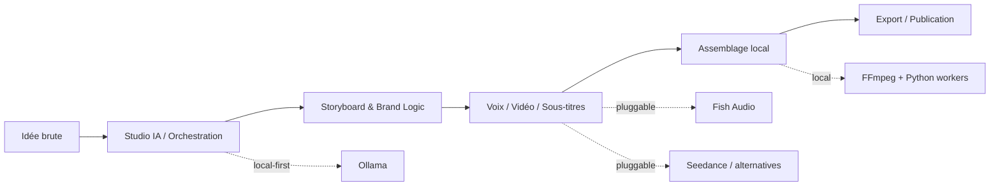

<div align="center">

# 🎬 VIDEO_TIKTOK

### The AI-native control tower for short-form video production

Turn a raw idea into a branded short-form content pipeline — with local-first orchestration, modular AI providers, and a creator workflow built to scale.

[](#current-status)
[](./LICENSE)
[](https://nextjs.org/)
[](https://react.dev/)
[](https://www.typescriptlang.org/)
[](https://www.postgresql.org/)
[](https://www.linkedin.com/in/your-linkedin/)

</div>

---

## Pourquoi ce projet peut faire très mal 🚀

Le marché de la vidéo courte IA est encore un puzzle : idéation, script, voix, vidéo, sous-titres, publication… tout est éclaté entre plusieurs outils.

**VIDEO_TIKTOK** vise à devenir l'orchestre complet :

- **une interface unique** pour piloter la production vidéo courte
- **une architecture modulaire** pour brancher plusieurs providers IA sans refacto du core
- **une logique brand-aware** pour garder une identité cohérente par chaîne
- **un mode local-first** pour garder le contrôle des coûts, des prompts et du workflow

En clair : moins de SaaS spaghetti, plus de contrôle, plus de cadence, plus de cohérence.

## Ce que le repo fait aujourd'hui

Le projet est en **phase Alpha** avec des fondations déjà solides côté produit et architecture.

### Déjà en place

- **CRUD des chaînes** avec base Brand Kit
- **base PostgreSQL + Drizzle ORM** prête pour les runs, étapes, clips et traces agents
- **interface Next.js structurée** avec navigation, sidebar, topbar et pages dédiées
- **architecture pensée pour une orchestration IA multi-provider**
- **setup local** Node + Python + FFmpeg + PostgreSQL

### En construction

- orchestration complète des runs vidéo
- extraction virale YouTube
- génération vidéo / TTS / publication sociale
- gestion avancée des services, quotas et connexions
- monitoring temps réel des providers et des coûts

## La vision produit

L'objectif est simple : construire un **studio de production IA pour créateurs solo**, capable de transformer une idée brute en pipeline éditorial industrialisé.

À terme, VIDEO_TIKTOK doit permettre de :

- structurer une idée via un **studio virtuel d'agents IA**
- produire un storyboard cohérent avec le **Brand Identity Kit**
- orchestrer la voix, la vidéo et l'assemblage final
- localiser le contenu en plusieurs langues
- exporter, publier et scaler sans multiplier les outils

## Stack technique

| Couche | Stack |
| --- | --- |
| Frontend | Next.js 16, React 19, TypeScript 5, Tailwind CSS 4 |
| UI | shadcn, Base UI, Lucide React |
| State | Zustand |
| Backend app | App Router + API Routes |
| Database | PostgreSQL 17 + Drizzle ORM |
| Workers locaux | Python 3.12+ |
| Média & tooling | FFmpeg |
| Providers visés | Ollama, Fish Audio, Seedance, providers vidéo/TTS interchangeables |

## Architecture, en un regard



## Ce qui rend VIDEO_TIKTOK différent

### 1. Local-first, pas local-only

L'idée n'est pas de tout faire en local à tout prix.
L'idée est de **garder le cerveau, l'orchestration et la logique métier sous contrôle**, puis d'utiliser les meilleurs providers au bon endroit.

### 2. Architecture pluggable

Le repo est pensé pour que les briques changent vite :

- un nouveau modèle vidéo sort ? il s'intègre derrière la même interface
- un provider TTS tombe ? on bascule
- un LLM local devient meilleur ? on le branche

### 3. Brand identity comme primitive produit

Ici, une chaîne n'est pas juste un nom.
C'est un **pack d'identité** : style, voix, palette, références visuelles, tonalité.

### 4. Vision produit orientée créateur opérateur

Ce projet n'est pas un gadget de démo.
Il est pensé comme une **machine de production** pour quelqu'un qui veut publier souvent, bien, et avec une logique système.

## Quick start

### Prérequis

- Node.js
- Python **3.12+**
- FFmpeg
- PostgreSQL **17**

### Installation express

```bash
cp .env.example .env.local
./install.sh
npm run dev
```

L'application sera disponible sur `http://localhost:3000`.

## Variables d'environnement

Le repo fournit un fichier `.env.example` minimal.

| Variable | Description |
| --- | --- |
| `DATABASE_URL` | connexion PostgreSQL locale |
| `SEEDANCE_API_KEY` | clé API provider vidéo |
| `FISH_AUDIO_API_KEY` | clé API voice / TTS |
| `OLLAMA_URL` | endpoint local Ollama |
| `PEXELS_API_KEY` | source média stock optionnelle |
| `PIXABAY_API_KEY` | source média stock optionnelle |

## Structure du repo

```text
src/
├── app/           # pages Next.js
├── components/    # UI components
├── lib/           # logique partagée
├── store/         # state management
└── types/         # types TypeScript

scripts/           # scripts utilitaires
storage/           # artefacts locaux
templates/         # templates futurs du pipeline
```

## Current status

Le bon wording ici, c'est : **ambitieux, structuré, en construction**.

Si tu explores le repo aujourd'hui, tu verras surtout :

- une **base produit claire**
- une **architecture prête à monter en puissance**
- les premiers écrans de pilotage
- les fondations de données pour le pipeline complet

Le moteur full end-to-end arrive ensuite.

## Roadmap produit

- [x] fondations Next.js + Drizzle + PostgreSQL
- [x] gestion des chaînes / structure Brand Kit
- [x] architecture UI de pilotage
- [ ] orchestration complète des runs
- [ ] connexions providers & monitoring temps réel
- [ ] génération vidéo / audio / sous-titres
- [ ] extraction virale YouTube
- [ ] publication multi-plateforme

## Pourquoi suivre ce repo

Parce qu'il attaque un vrai sujet :

> **comment transformer la création vidéo IA en système opérable, cohérent et scalable ?**

Pas juste “faire une vidéo”.
Construire le cockpit qui permet d'en produire **beaucoup**, avec une identité forte, des coûts maîtrisés et une architecture qui survit au prochain raz-de-marée IA.

## Licence

Distribué sous licence **MIT**. Voir [`LICENSE`](./LICENSE).

## Auteur

**Malik Karaoui**

- LinkedIn : `à personnaliser dans le badge README`

---

<div align="center">
	<sub>Built for creators who want leverage, not tool fatigue.</sub>
</div>

<!-- TODO: Remplacer le lien LinkedIn du badge par l'URL réelle du profil. -->
